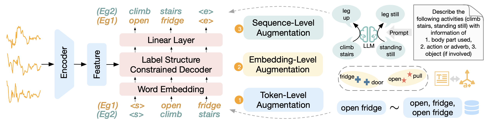

# SHARE
This is the official implementation of [Unleashing the Power of Shared Label Structures for Human Activity Recognition](https://arxiv.org/abs/2301.03462), CIKM 2023. 

In this paper, We find shared structures in Human Activity Recognition (HAR) label names map to similarity in the input data, leading to a more effective HAR framework, SHARE, by modeling label structures. SHARE captures knowledge across activities by uncovering information from label structures. We propose label augmentation methods leveraging large language models, to more effectively identify shared structures across activities. 



## Installation

- Create a conda environment (optional, but recommended).

```sh
conda create --name share --yes python=3.9 
conda activate share
```

- Install the package.

```sh
# install the package from local files
pip install --editable "."

# OR install the built package 
pip install semantichar
```

## Dataset 

* Time-series data and labels

  Create a folder under `dataset` with the name of the dataset (for example, for `Opp_g` dataset, we create the folder `./dataset/Opp_g`). 

  Create four data files in this folder: 

  * X_train.npy: training set time series of shape `(N_train * T * c)`, where `N_train` is the number of data samples in the training set, `T` is the sequence length, and `c` is the channel size.
  * X_test.npy: test set time series of shape `(N_test * T * c)`
  * y_train.npy: training set labels of shape `(N_train, )`, here labels are integer IDs
  * y_test.npy: test set labels of shape `(N_test, )`, here labels are integer IDs

  Two example folders of Opp_g data and PAMAP data can be download from [Google Drive link for Opp_g](https://drive.google.com/drive/folders/1srAdne1egaa-Ipw8VvUMUQu_qVz8-UA1?usp=drive_link) and [Google Drive link for PAMAP](https://drive.google.com/drive/folders/1C7rbGYZLJfGH5T1otdeBW40A-7lwYnzp?usp=sharing).

* configs

  Create a json config file under `configs`  with the name of the dataset (for example, for `Opp_g` dataset, we create the json file `./configs/Opp_g.json`). 

  In this config file, map the label integer IDs to their label name sequence. 

  Here is one example for Opp_g dataset:

  ```json
  {
      "label_dictionary": {
          "0": ["open", "door", "1"],
          "1": ["open", "door", "2"],
          "2": ["close", "door", "1"],
          "3": ["close", "door", "2"],
          "4": ["open", "fridge"],
          "5": ["close", "fridge"],
          "6": ["open", "dishwasher"],
          "7": ["close", "dishwasher"],
          "8": ["open", "drawer", "1"],
          "9": ["close", "drawer", "1"],
          "10": ["open", "drawer", "2"],
          "11": ["close", "drawer", "2"],
          "12": ["open", "drawer", "3"],
          "13": ["close", "drawer", "3"],
          "14": ["clean", "table"],
          "15": ["drink", "from", "cup"],
          "16": ["toggle", "switch"]
      }
  }
  ```

  Another example for PAMAP dataset:

  ```json
  {
      "label_dictionary": {
          "0": ["lying"],
          "1": ["sitting"],
          "2": ["standing"],
          "3": ["walking"],
          "4": ["running"],
          "5": ["cycling"],
          "6": ["nordic", "walking"],
          "7": ["ascending", "stairs"],
          "8": ["descending", "stairs"],
          "9": ["vacuum", "cleaning"],
          "10": ["ironing"],
          "11": ["rope", "jumping"]
      }
  }
  ```

## Train and Evaluate

```bash
# To train SHARE on GPU 0 with default parameters
CUDA_VISIBLE_DEVICES=0 bash bin/run.sh

# To train SHARE on GPU 0, Opp_g dataset with customized parameters
CUDA_VISIBLE_DEVICES=0 python ./bin/main.py \
    --batchSize 16 \
    --epochs 100 \
    --run_tag test \
    --dataset 'Opp_g' \
    --cuda \
    --visualize \
    --manualSeed 1

# To train SHARE on GPU 0, PAMAP dataset with customized parameters
CUDA_VISIBLE_DEVICES=0 python ./bin/main.py \
    --batchSize 16 \
    --epochs 150 \
    --run_tag test \
    --dataset 'PAMAP' \
    --cuda \
    --visualize \
    --manualSeed 1
```

Parameter configuration:

- dataset: HAR dataset 
- batch_size: batch size during training
- epochs: number of epochs during training
- visualize: whether to visualize the loss (need [wandb](https://docs.wandb.ai/quickstart) account)

## Citation

If you find this useful, please cite our paper

```
@inproceedings{zhang2023unleashing,
  title={Unleashing the Power of Shared Label Structures for Human Activity Recognition},
  author={Zhang, Xiyuan and Chowdhury, Ranak Roy and Zhang, Jiayun and Hong, Dezhi and Gupta, Rajesh K and Shang, Jingbo},
  booktitle={Proceedings of the 32nd ACM International Conference on Information and Knowledge Management},
  pages={3340--3350},
  year={2023}
}
```

